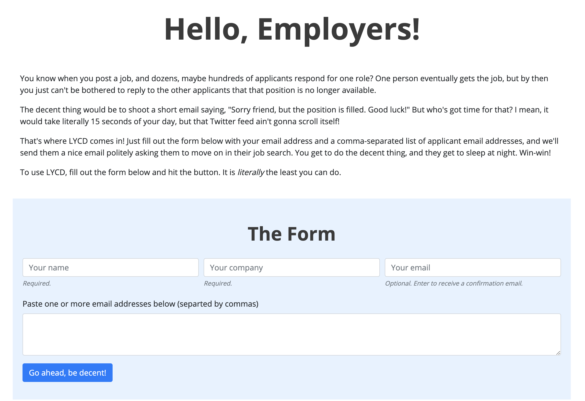
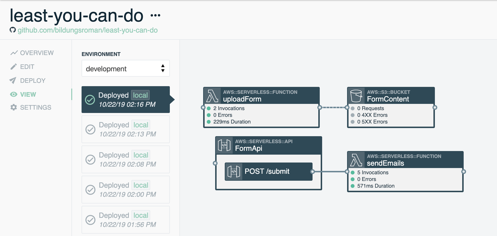

# Least You Can Do (LYCD)
Employers, this is _literally_ the least you can do.

## Description

This stack consists of a serverless website that looks like this:



And a backend API that sends out emails using AWS Simple Email Service (SES).

## Instructions

The easiest way to deploy this app is to use the same tool I used to build it: [Stackery](https://www.stackery.io/). The finished stack looks like this:



If you don't already have a Stackery account, [sign up for an account](https://app.stackery.io/sign-up), then follow the [Quickstart](https://docs.stackery.io/docs/quickstart/quickstart-nodejs/) to get everything up and running. To import an existing stack, you'll need Pro features. Luckily, there's a free seven-day trial, so go ahead and [start that](https://app.stackery.io/settings/billing) too.

Once you're all set up in Stackery, follow the instructions to create and deploy this stack.

### Setup

1. Fork this stack
2. Navigate to your [stacks](https://app.stackery.io/stacks) in Stackery, and click __Add a Stack__
3. Choose Github as your __Git Hosting Provider__ and link your Github if you haven't yet
4. Enter a name for your stack (I called mine 'least-you-can-do', but you can call yours 'jeff' for all it matters)
5. Select __Use Existing Repo__ and enter your forked repo URL
6. Click __Add Stack__ to add your stack

Before deploying, you need to add the email address you want to send your emails from to your environment parameters.

1. Navigate to your [environments](https://app.stackery.io/environments) in Stackery, and select the environment you'd like to deploy to
2. Open the parameters tab for that environment, and add the following, replacing `<your email>` with, well, your email:
   ```json
      "senderEmail": "<your email>"
   ```
3. Click the big green __Save__ button

The final part before deploying is getting SES to work:

1. In the AWS Console, navigate to the __Simple Email Service__ page
2. Click __Go to identity management__
3. In the left sidebar, choose __Email Addresses__
4. Click __Verify a New Email Address__ at the top
5. Enter the same email address as you added to your environment parameters, then click __Verify This Email Address__
6. You will receive a verification email. Click the link and you will see that your email is now verified

### Deploy and test

1. Navigate back to your stack page in Stackery, and hit the __Deploy__ tab
2. Choose the environment with the email parameters from earlier, and click __+ Prepare new deployment__
3. Click __Deploy__ when it's prepared, then __Execute__ in the AWS Console
4. Grab a cup of coffee, this will take a few minutes

Once your stack is deployed, navigate to the __View__ tab, double-click on the __FormContent__ bucket, and follow the link at __WEBSITE HOSTING ADDRESS__. Try it out, and send it out next time a potential employer fails to acknowledge your humanity!